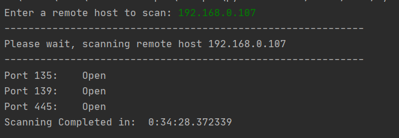

# Port_Scan 
  
A lot of times, a remote host, gets bound to a port and starts running a process on it. This is not only undesirable but also can be dangerous.
I made a set of two scripts, in order to solve the mess. One to check the currently active ports, another one to kill the process running on them.

The Script uses `psutil` module to solve the purpose, unarguably the `lsof` package provided in Linux is way better.
But as it is not cross platform, I have hardcoded using `psutil`.
## Setup instructions  
  
There are 2 scripts.  
- [ports_scan.py](./ports_scan.py)  
- [ports_kill.py](./ports_kill.py) 

1. Setup a Virtual Environment.
1. Install dependencies using `pip3 install -r requirements.txt`
1. Go through the comments and the interactive options. 
  
## Output  
  
Sample Outputs -   
  
- **ports_scan.py** 
  
  
  
- **ports_kill.py**

  

  
  
  
## Author(s)  
  
Made by [Vybhav Chaturvedi](https://www.linkedin.com/in/vybhav-chaturvedi-0ba82614a/)